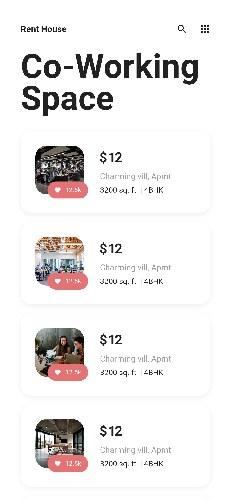

# Property Rental UI

A beautiful UI for a property rental app, built using Flutter. The app UI is built in 2 pages - one for listing the available properties and the other for displaying more details about the selected property. The Flutter app is for the representation only and does not process any external data. No external pub dependencies used.

## Links

Design inspiration - [https://www.instagram.com/p/B_kARogg3rs/](https://www.instagram.com/p/B_kARogg3rs/) 

Image assets - [https://unsplash.com/s/photos/office](https://unsplash.com/s/photos/office)

Flutter - [https://flutter.dev](https://flutter.dev)